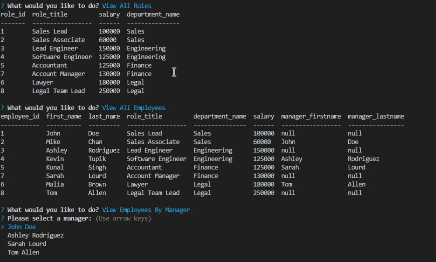

# SQL Challenge: Employee Tracker

## Description
A command-line application built to track a company's employee list, using Node.js, Inquirer, and MySQL. It is a Content management system (CMS) which allows users to easily view and interact with information stored in databases.

## User Story
```
AS A business owner
I WANT to be able to view and manage the departments, roles, and employees in my company
SO THAT I can organize and plan my business
```

## Acceptance Criteria
```
GIVEN a command-line application that accepts user input
WHEN I start the application
THEN I am presented with the following options: view all departments, view all roles, view all employees, add a department, add a role, add an employee, and update an employee role
WHEN I choose to view all departments
THEN I am presented with a formatted table showing department names and department ids
WHEN I choose to view all roles
THEN I am presented with the job title, role id, the department that role belongs to, and the salary for that role
WHEN I choose to view all employees
THEN I am presented with a formatted table showing employee data, including employee ids, first names, last names, job titles, departments, salaries, and managers that the employees report to
WHEN I choose to add a department
THEN I am prompted to enter the name of the department and that department is added to the database
WHEN I choose to add a role
THEN I am prompted to enter the name, salary, and department for the role and that role is added to the database
WHEN I choose to add an employee
THEN I am prompted to enter the employee’s first name, last name, role, and manager, and that employee is added to the database
WHEN I choose to update an employee role
THEN I am prompted to select an employee to update and their new role and this information is updated in the database
```
## Installation
Before running the employee tracker app, please ensure all the necessary node modules are installed:
```
npm install
```
Create the SQL Database using the .db/schema.sql

Populate the database with .db/seeds.sql

You can run the application using the following command:
```
npm start
```
## Mock-Up
The following is a screenshot of the application:


## Walkthrough Video
Follow the link to watch the video that demostrates the functionality of the employee tracker:
[URL]()
